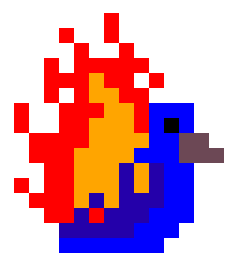
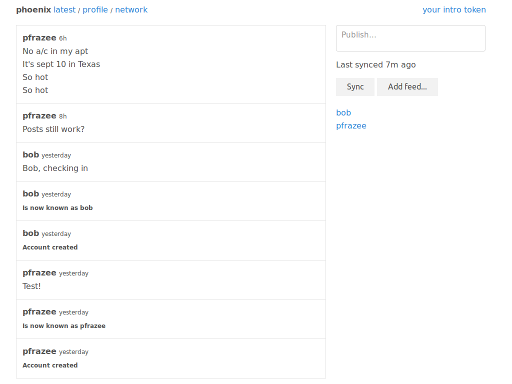

Phoenix v1
==========

 **It's distributed!**



Social feeds without ads or owners.

Phoenix is a peer-to-peer network. It uses crytographic keypairs to create feeds and publish unforgeable entries which can spread across the network (see [secure-scuttlebutt](https://github.com/dominictarr/secure-scuttlebutt)). Relay servers optionally aggregate and redistribute the feeds.

## Getting Started

**To install on your localhost**

```
git clone https://github.com/pfraze/phoenix.git
cd phoenix
npm install
./phoenix setup
./phoenix-web start
```

The web host runs a private instance on `localhost:64000`.

**To setup a relay**

```
./phoenix-relay deploy user@host.com
```

After requesting your password, this command will open an ssh connection to your server, install phoenix, and start the relay daemon. To start the daemon manually, run:

```
./phoenix-relay start -d
```

To stop it, run:

```
./phoenix-relay stop
```

## License

Copyright (c) 2014 Dominic Tarr and Paul Frazee

Permission is hereby granted, free of charge, to any person obtaining
a copy of this software and associated documentation files (the
"Software"), to deal in the Software without restriction, including
without limitation the rights to use, copy, modify, merge, publish,
distribute, sublicense, and/or sell copies of the Software, and to
permit persons to whom the Software is furnished to do so, subject to
the following conditions:

The above copyright notice and this permission notice shall be
included in all copies or substantial portions of the Software.

THE SOFTWARE IS PROVIDED "AS IS", WITHOUT WARRANTY OF ANY KIND,
EXPRESS OR IMPLIED, INCLUDING BUT NOT LIMITED TO THE WARRANTIES OF
MERCHANTABILITY, FITNESS FOR A PARTICULAR PURPOSE AND
NONINFRINGEMENT. IN NO EVENT SHALL THE AUTHORS OR COPYRIGHT HOLDERS BE
LIABLE FOR ANY CLAIM, DAMAGES OR OTHER LIABILITY, WHETHER IN AN ACTION
OF CONTRACT, TORT OR OTHERWISE, ARISING FROM, OUT OF OR IN CONNECTION
WITH THE SOFTWARE OR THE USE OR OTHER DEALINGS IN THE SOFTWARE.